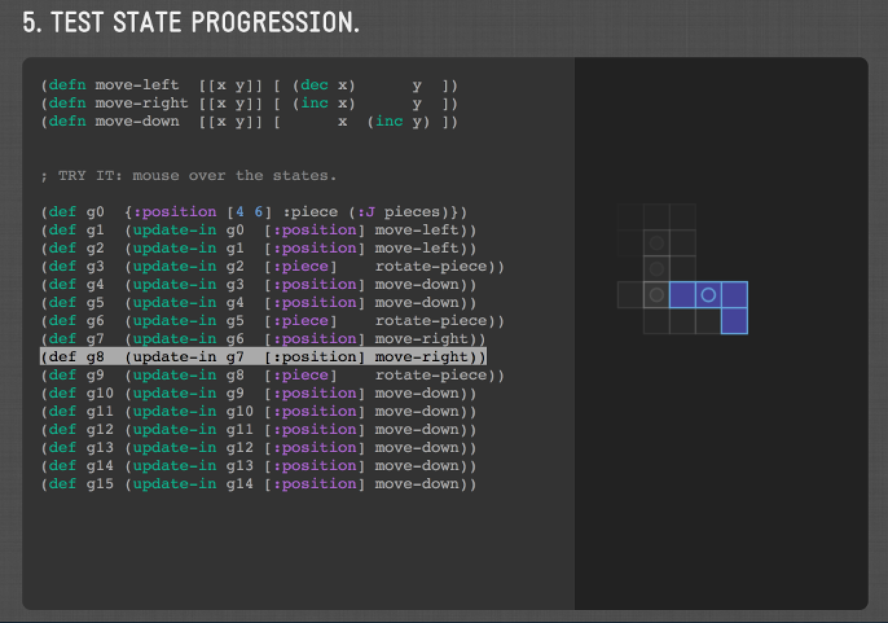

# Interactive Guide to Tetris in ClojureScript

[VIEW SLIDES HERE](http://shaunlebron.com/t3tr0s-slides)

These are interactive slides that I put together for a [Houston.js meetup
party](http://www.meetup.com/houston-js/events/198371042/) celebrating Tetris's
30th birthday.

## Setup

1. Install [Leiningen](http://leiningen.org)
1. Run `lein cljsbuild auto` to run the auto-compiler.
1. Open `public/index.html`.
1. `Shift`+`Right|Left` to navigate slides.

## Implementation

The presentation itself is written in ClojureScript using
[Om/React](https://github.com/swannodette/om).  Its implementation is rushed.
I duplicated a lot of functions and data between slides, and I'm using an Om
"root" for every slide for some reason.  I also manually highlighted all the
displayed code out of frustration with highlighting libraries.

## Why

The presentation is intended to conclude our work on
[T3TR0S](https://github.com/imalooney/t3tr0s).  You can read our devblog there
to see how we built the game in small increments.

## Want more code?

This repo presents the essence of our game.  But you can see full
implementations below:

- [t3tr0s-full](http://github.com/imalooney/t3tr0s) fully-featured multiplayer
- [t3tr0s-bare](http://github.com/shaunlebron/t3tr0s-bare) simple version, easier to read

## Thanks

Thanks to Chris Granger for his [live-cljs
demo](https://github.com/ibdknox/live-cljs), which served as the styling base
for this presentation.

And thanks to the T3TR0S team:

- Elaine Looney
- Luis Gutierrez
- Chris Oakman
- Brett Darnell
- Phil Gambling

